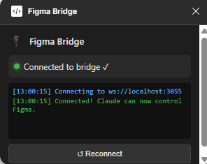

# Figma Bridge MCP

Figma Bridge MCP is a local [Model Context Protocol (MCP)](https://modelcontextprotocol.io/) server that connects MCP-compatible AI clients to the Figma desktop app. It lets an AI assistant inspect the current Figma or FigJam document, export nodes, and make controlled changes through the Figma Plugin API.

## Plugin Preview



The plugin window shows the bridge connection status, recent connection events, and a manual reconnect button. Keep this window open while your MCP client is working with Figma.

## Features

- Inspect the current page, selected layers, individual nodes, local styles, variables, and components.
- Export Figma nodes as PNG, SVG, or PDF.
- Update text and solid fill colors.
- Create, move, resize, and delete nodes.
- Run advanced JavaScript through the Figma Plugin API.
- Use node IDs copied from Figma URLs in either `1:23` or `1-23` format.
- Connect multiple MCP client processes through a shared local bridge server.
- Use the Windows Figma desktop app from AI agents running natively on Windows or inside WSL2.
- Work with any MCP client that supports stdio servers, including Codex, Claude Code, and VS Code MCP clients.

## How It Works

```text
┌──────────────────────────────┐
│ MCP client                   │
│ Codex, Claude Code, VS Code  │
└──────────────┬───────────────┘
               │ MCP over stdio
┌──────────────▼───────────────┐
│ server.js                    │
│ Node.js MCP/WebSocket bridge │
└──────────────┬───────────────┘
               │ ws://localhost:3055
┌──────────────▼───────────────┐
│ Figma Bridge plugin          │
│ ui.html ↔ code.js            │
└──────────────┬───────────────┘
               │ Figma Plugin API
┌──────────────▼───────────────┐
│ Open Figma or FigJam file    │
└──────────────────────────────┘
```

The first `server.js` process that acquires port `3055` becomes the primary bridge. If another MCP client starts another instance, that process automatically enters proxy mode and forwards its commands to the primary bridge. When multiple Figma plugins are connected, commands are sent to the most recently connected plugin.

## Requirements

- [Node.js](https://nodejs.org/) and npm. The current Node.js LTS release is recommended.
- The Figma desktop app.
- An MCP client with stdio server support.

Install Node.js in the same environment where the AI client will launch the MCP server: install Windows Node.js for native Windows clients or Linux Node.js inside WSL for WSL clients. The server itself is platform-independent. `start.bat` is included only as an optional Windows helper.

## Installation

Clone this repository and install its dependency:

```sh
git clone https://github.com/Halil-KAPLAN/figma-bridge-mcp.git
cd figma-bridge-mcp
npm install
```

You can also download the repository as a ZIP file, extract it, open a terminal in the extracted directory, and run `npm install`.

## Windows and WSL2 Support

Figma Bridge MCP supports both Windows-native development and WSL2 development. Figma always runs as the Windows desktop application; the MCP server runs in the same environment as the AI agent that launches it.

| Development environment            | Where Node.js and this repository run                         | Path used in MCP configuration          | Figma application     |
| ---------------------------------- | ------------------------------------------------------------- | --------------------------------------- | --------------------- |
| Native Windows                     | Windows                                                       | `C:\path\to\figma-bridge-mcp\server.js` | Windows Figma Desktop |
| WSL2 terminal                      | WSL2 Linux                                                    | `/home/user/figma-bridge-mcp/server.js` | Windows Figma Desktop |
| VS Code opened normally on Windows | Windows, unless the agent is explicitly configured to use WSL | Windows path                            | Windows Figma Desktop |
| VS Code Remote - WSL               | WSL2 Linux                                                    | WSL Linux path                          | Windows Figma Desktop |

### How the WSL2 connection works

When `server.js` runs inside WSL2, it opens the WebSocket bridge on port `3055`. Windows forwards WSL networking applications to `localhost`, so the Windows Figma plugin can still connect to:

```text
ws://localhost:3055
```

The complete WSL flow is:

```text
AI agent in WSL
    → starts server.js in WSL over stdio
    → WSL WebSocket server listens on port 3055
    → Windows exposes the WSL service through localhost:3055
    → Figma Desktop plugin connects from Windows
    → the agent can inspect and edit the open Figma document
```

Microsoft documents Windows-to-WSL access through `localhost` in [Accessing network applications with WSL](https://learn.microsoft.com/windows/wsl/networking).

### Native Windows setup

Use a repository stored on the Windows file system and install dependencies with Windows Node.js:

```powershell
git clone https://github.com/Halil-KAPLAN/figma-bridge-mcp.git
cd figma-bridge-mcp
npm install
```

The MCP command must use the Windows copy of Node.js and a Windows path to `server.js`.

### WSL2 setup

For WSL development, keep the repository in the Linux file system and install dependencies inside WSL:

```sh
mkdir -p ~/code
cd ~/code
git clone https://github.com/Halil-KAPLAN/figma-bridge-mcp.git
cd figma-bridge-mcp
npm install
```

Open the WSL project in VS Code with:

```sh
code .
```

Confirm that VS Code displays **WSL: &lt;distribution&gt;** in the remote status indicator and that its integrated terminal uses paths such as `/home/user/...`. See the [VS Code WSL tutorial](https://code.visualstudio.com/docs/remote/wsl-tutorial) for the Remote - WSL workflow.

While the bridge is running in WSL, you can test access from Windows with:

```powershell
Test-NetConnection localhost -Port 3055
```

`TcpTestSucceeded` should be `True`.

### Keep the agent and MCP server in the same environment

The `node` command and the `server.js` path are resolved by the environment where the AI agent is running:

- A Windows-native agent needs Windows Node.js and a Windows path.
- An agent running in WSL needs Node.js installed in WSL and a Linux path.
- A VS Code Remote - WSL window should configure the MCP server from its WSL integrated terminal.
- Do not use a `C:\...` path in a WSL MCP configuration or a `/home/...` path in a native Windows MCP configuration.

For the most predictable behavior, use one canonical installation per environment and configure all agents in that environment to launch the same `server.js` file. Multiple MCP processes in the same environment are supported: the first becomes the primary bridge and later processes automatically proxy through it.

## Use Figma Bridge MCP in Figma

Figma Bridge MCP includes a local Figma development plugin. It does not need to be installed from the Figma Community. The plugin runs inside the open Figma or FigJam document and relays MCP commands between the local bridge server and the Figma Plugin API.

### Install the plugin once

Development plugins must be imported with the Figma desktop app:

1. Open the Figma desktop app on macOS or Windows.
2. Create or open any Figma Design or FigJam file.
3. Open the Figma menu in the upper-left corner.
4. Select **Plugins → Development → Import new plugin from manifest...**.
5. Browse to this repository and select [`plugin/manifest.json`](plugin/manifest.json).
6. Figma adds **Figma Bridge** to the **Development** section of the Plugins menu.

The manifest only needs to be imported once on each computer. See [Figma's development plugin guide](https://help.figma.com/hc/en-us/articles/360042786733-Create-a-plugin-for-development) for more information about importing local plugins.

### Run the plugin for each session

1. Open the Figma Design or FigJam file that you want the AI agent to inspect or edit.
2. Start or reload your configured MCP client. It will normally launch `server.js` automatically. You can run `npm start` manually for diagnostics.
3. In Figma, select **Plugins → Development → Figma Bridge**.
4. Keep the plugin window open while the AI agent is using Figma.
5. Wait until the plugin displays **Connected to bridge ✓**.

The plugin connects to `ws://localhost:3055`. If the MCP server is not running yet, the plugin remains on **Connecting...** and retries automatically. You can therefore start the Figma plugin or the MCP client first.

The open document is the active target. If you switch documents, run the plugin in the document that you want the agent to use. Commands such as `figma_get_selection` operate on the layers currently selected in that document.

### Let an AI agent use Figma through MCP

After the plugin shows **Connected to bridge ✓**, any configured AI agent that supports stdio MCP servers can discover and call the Figma Bridge MCP tools. The agent does not connect directly to your Figma account and does not require a Figma access token. Requests follow this path:

```text
AI agent → MCP tool → server.js → Figma plugin → Figma document
```

The plugin executes the requested operation through the Figma Plugin API and returns the result to the agent over the same connection. The agent can then inspect the result, continue with another tool, or explain the changes it made.

## Add Figma Bridge MCP to an AI Application

Figma Bridge MCP is a local stdio MCP server. The AI application launches it with this command:

```text
node /absolute/path/to/figma-bridge-mcp/server.js
```

The path must be valid in the environment where the AI application runs. You normally do not need to run `npm start` separately because the MCP client starts and manages `server.js` itself.

### Codex CLI and Codex IDE extension

#### Codex running on Windows

Run this command in PowerShell or the VS Code Windows terminal:

```powershell
codex mcp add figma-bridge-mcp -- node C:\path\to\figma-bridge-mcp\server.js
```

#### Codex running in WSL2

Run this command in the WSL terminal or the VS Code Remote - WSL integrated terminal:

```sh
codex mcp add figma-bridge-mcp -- node /home/user/code/figma-bridge-mcp/server.js
```

Verify the configuration:

```sh
codex mcp list
```

Inside Codex, use `/mcp` to inspect the connected server and its tools. Codex CLI and the Codex IDE extension share `config.toml` when they run on the same host, so adding the server from the terminal also makes it available to the extension in that environment.

The equivalent Codex configuration is:

```toml
[mcp_servers.figma-bridge-mcp]
command = "node"
args = ["/absolute/path/to/figma-bridge-mcp/server.js"]
```

On Windows, the Codex IDE extension can also run Codex inside WSL by enabling this VS Code setting:

```json
"chatgpt.runCodexInWindowsSubsystemForLinux": true
```

When that setting is enabled, install Node.js and Figma Bridge MCP inside WSL and use the WSL path in the Codex MCP configuration. In a VS Code Remote - WSL window, Codex already runs with the WSL project environment.

See the official [Codex MCP documentation](https://learn.chatgpt.com/docs/extend/mcp.md) for MCP configuration and the [Codex WSL documentation](https://learn.chatgpt.com/docs/windows/wsl.md) for the WSL workflow.

### Claude Code CLI and VS Code extension

Claude Code MCP servers are most reliably added from a terminal. The VS Code extension can then manage and use the configured server.

#### Claude Code running on Windows

Run this command in PowerShell or the VS Code Windows terminal:

```powershell
claude mcp add --transport stdio --scope user figma-bridge-mcp -- node C:\path\to\figma-bridge-mcp\server.js
```

#### Claude Code running in WSL2

Run this command in the WSL terminal or the VS Code Remote - WSL integrated terminal:

```sh
claude mcp add --transport stdio --scope user figma-bridge-mcp -- node /home/user/code/figma-bridge-mcp/server.js
```

Verify the configuration:

```sh
claude mcp list
```

In Claude Code CLI or the VS Code chat panel, use `/mcp` to view the connection and available tools. When VS Code is connected through Remote - WSL, run `claude mcp add` from the WSL integrated terminal so the command and Linux path are stored in the WSL Claude Code configuration.

See the official [Claude Code MCP documentation](https://code.claude.com/docs/en/mcp) and [Claude Code VS Code documentation](https://code.claude.com/docs/en/ide-integrations).

### VS Code `.vscode/mcp.json`

Some VS Code MCP clients read workspace servers from `.vscode/mcp.json`. Use the configuration that matches the extension host.

Windows-native VS Code:

```json
{
  "servers": {
    "figma-bridge-mcp": {
      "type": "stdio",
      "command": "node",
      "args": ["C:\\path\\to\\figma-bridge-mcp\\server.js"]
    }
  }
}
```

VS Code Remote - WSL:

```json
{
  "servers": {
    "figma-bridge-mcp": {
      "type": "stdio",
      "command": "node",
      "args": ["/home/user/code/figma-bridge-mcp/server.js"]
    }
  }
}
```

### Other terminal and desktop AI clients

Any AI client that supports local stdio MCP servers can use Figma Bridge MCP. Look for an **MCP Servers**, **Tools**, or **Integrations** setting and add a server with:

- Name: `figma-bridge-mcp`
- Transport: `stdio`
- Command: `node`
- Arguments: the absolute path to `server.js`

A common JSON format is:

```json
{
  "mcpServers": {
    "figma-bridge-mcp": {
      "type": "stdio",
      "command": "node",
      "args": ["/absolute/path/to/figma-bridge-mcp/server.js"]
    }
  }
}
```

The exact configuration filename and the top-level key (`mcpServers` or `servers`) depend on the client. Terminal applications follow the same environment rule: use a Windows path when the application runs in Windows and a Linux path when it runs in WSL.

## Use It with an AI Agent

After installing the Figma plugin and configuring your MCP client:

1. Open the target document in the Figma desktop app.
2. Run **Plugins → Development → Figma Bridge** and keep its window open.
3. Start or reload the AI agent so it launches the MCP server and discovers its tools.
4. Ask the agent to check the connection. It should call `figma_status` and report that the plugin is connected.
5. Ask the agent to inspect or modify the open document using natural language.

For example:

```text
Check whether the Figma plugin is connected.
Show the structure of the current Figma page.
Get the details of node 2057:6604.
Export node 2057:6604 as a PNG at 2x scale.
Change the selected heading to "Welcome back".
List all local components on the current page.
```

When a node ID comes from a Figma URL such as `node-id=2057-6604`, you can pass either `2057-6604` or `2057:6604` to the bridge.

The AI agent decides which MCP tools to call based on your request. You can also explicitly name a tool when you need a specific operation, such as `figma_get_selection`, `figma_export_node`, or `figma_set_text`.

## Available MCP Tools

### Connection and inspection

| Tool                   | Inputs   | Description                                                     |
| ---------------------- | -------- | --------------------------------------------------------------- |
| `figma_status`         | None     | Reports whether a Figma plugin is connected                     |
| `figma_get_page`       | None     | Returns the current page and its direct children                |
| `figma_get_node`       | `nodeId` | Returns a node's properties and direct children                 |
| `figma_get_selection`  | None     | Returns detailed information about the currently selected nodes |
| `figma_get_styles`     | None     | Lists local paint, text, and effect styles                      |
| `figma_get_variables`  | None     | Lists local variable collections, modes, and variables          |
| `figma_get_components` | None     | Lists components on the current page                            |

### Export

| Tool                | Inputs                                        | Description                                                      |
| ------------------- | --------------------------------------------- | ---------------------------------------------------------------- |
| `figma_export_node` | `nodeId`, optional `format`, optional `scale` | Exports a node as `PNG`, `SVG`, or `PDF` and returns base64 data |

The default export format is PNG and the default scale is `1`.

### Editing

| Tool                 | Inputs                                                                       | Description                                                                |
| -------------------- | ---------------------------------------------------------------------------- | -------------------------------------------------------------------------- |
| `figma_set_text`     | `nodeId`, `text`                                                             | Replaces the content of a text node                                        |
| `figma_set_fill`     | `nodeId`, `hex`                                                              | Replaces a node's fills with one solid hex color                           |
| `figma_create_frame` | `name`, `width`, `height`, optional `x`, optional `y`                        | Creates a frame on the current page                                        |
| `figma_create_text`  | `text`, optional `x`, optional `y`, optional `fontSize`, optional `parentId` | Creates an Inter Regular text node on the current page or in a parent node |
| `figma_delete_node`  | `nodeId`                                                                     | Deletes a node                                                             |
| `figma_move_node`    | `nodeId`, `x`, `y`                                                           | Changes a node's position                                                  |
| `figma_resize_node`  | `nodeId`, `width`, `height`                                                  | Changes a node's dimensions                                                |

### Advanced

| Tool           | Inputs | Description                                                  |
| -------------- | ------ | ------------------------------------------------------------ |
| `figma_run_js` | `code` | Runs JavaScript with access to the `figma` Plugin API object |

`figma_run_js` is intended for operations not covered by the dedicated tools. The supplied code runs inside the Figma plugin sandbox and may modify the open document.

## Running the Server Manually

Manual startup is useful for diagnostics, but is not required when your MCP client is configured to launch the server.

```sh
npm start
```

On Windows, you can also double-click `start.bat`.

Expected log output from a primary server:

```text
[figma-bridge-mcp] Starting Figma Bridge MCP Server...
[figma-bridge-mcp] PRIMARY mode — listening at ws://localhost:3055
[figma-bridge-mcp] MCP stdio ready
```

If another Figma Bridge process already owns the port, the new process enters proxy mode. This is expected:

```text
[figma-bridge-mcp] Port is in use; switching to proxy mode...
[figma-bridge-mcp] Connected to the primary server
```

## Project Structure

```text
figma-bridge-mcp/
├── plugin/
│   ├── code.js          # Commands executed in the Figma plugin sandbox
│   ├── ui.html          # Plugin UI and WebSocket client
│   └── manifest.json    # Figma development plugin manifest
├── server.js            # MCP stdio server and WebSocket bridge
├── start.bat            # Optional Windows launcher
├── package.json         # Node.js package metadata and scripts
└── README.md
```

The only runtime npm dependency is [`ws`](https://www.npmjs.com/package/ws), which provides the WebSocket server and client implementation.

## Troubleshooting

### `No Figma plugin connected`

- Use the Figma desktop app, not the browser version.
- Open the Figma or FigJam file you want to work with.
- Run **Plugins → Development → Figma Bridge**.
- Keep the plugin window open.
- Wait a few seconds for the plugin's automatic reconnect attempt.
- Confirm that the plugin displays **Connected to bridge ✓**.

### The plugin stays on `Connecting...`

- Confirm that the MCP client has started `server.js`, or run `npm start` temporarily for diagnostics.
- Confirm that port `3055` is not blocked by a firewall or security tool.
- Check whether an unrelated application is already using port `3055`.
- Reload the plugin after the bridge server starts.

### Windows Figma cannot reach the bridge running in WSL2

Confirm that the server is listening inside WSL:

```sh
ss -ltnp | grep 3055
```

Then test the forwarded port from Windows PowerShell:

```powershell
Test-NetConnection localhost -Port 3055
```

If `TcpTestSucceeded` is `False`:

- Confirm that you are using WSL2 with `wsl --list --verbose` in PowerShell.
- Update WSL with `wsl --update`, then restart it with `wsl --shutdown`.
- Restart the MCP client and rerun the Figma plugin.
- Check whether a VPN, firewall, endpoint security tool, or unrelated process is blocking port `3055`.
- Confirm that Node.js and `npm install` were run inside WSL rather than only on Windows.

Do not replace the plugin URL with a WSL virtual-machine IP. Windows-to-WSL localhost forwarding is the intended connection path and avoids depending on an IP address that can change after WSL restarts.

### The MCP server is not detected

- Confirm that Node.js is available:

  ```sh
  node --version
  ```

- Confirm that dependencies are installed:

  ```sh
  npm install
  ```

- Use an absolute path to `server.js`.
- Escape Windows backslashes correctly in JSON.
- Restart or reload the MCP client after changing its configuration.
- Check the MCP client's server logs for Node.js or path errors.

### `Port is in use; switching to proxy mode...`

This message is normal when another Figma Bridge instance is already running. If the proxy cannot connect, stop the unrelated process using port `3055` or change the port consistently in `server.js`, `plugin/ui.html`, and `plugin/manifest.json`.

### A command times out

- Confirm that the plugin is still open and connected.
- Confirm that the target document is still open in Figma.
- Check that the node ID exists in the current document.
- Retry the request after reconnecting the plugin. Bridge requests time out after 30 seconds.

## Current Limitations

- The bridge is designed for local use and uses the fixed WebSocket port `3055`.
- The Figma development plugin must remain open during a session.
- Commands target the most recently connected plugin when multiple plugin windows are open.
- `figma_get_page` returns the page's direct children rather than recursively expanding the entire document tree. Use `figma_get_node` for more detail.
- Exports are returned as base64 data; the MCP client is responsible for saving them as files.
- There is no authentication layer between the local WebSocket server and plugin.

## Security

Figma Bridge MCP is intended for local development. Do not expose port `3055` to untrusted networks. Only connect MCP clients you trust, and review commands before allowing them to modify important design files.

The `figma_run_js` tool can execute arbitrary JavaScript in the Figma plugin sandbox. It is powerful enough to inspect or modify the open document and should only be used with trusted prompts and trusted MCP clients.

## Development

Install dependencies and start the server:

```sh
npm install
npm start
```

Changes to `server.js` require restarting the MCP server process. Changes to files under `plugin/` require reloading or rerunning the development plugin in Figma.

## License

This repository does not currently include a license. Add a `LICENSE` file before distributing or accepting third-party contributions.
